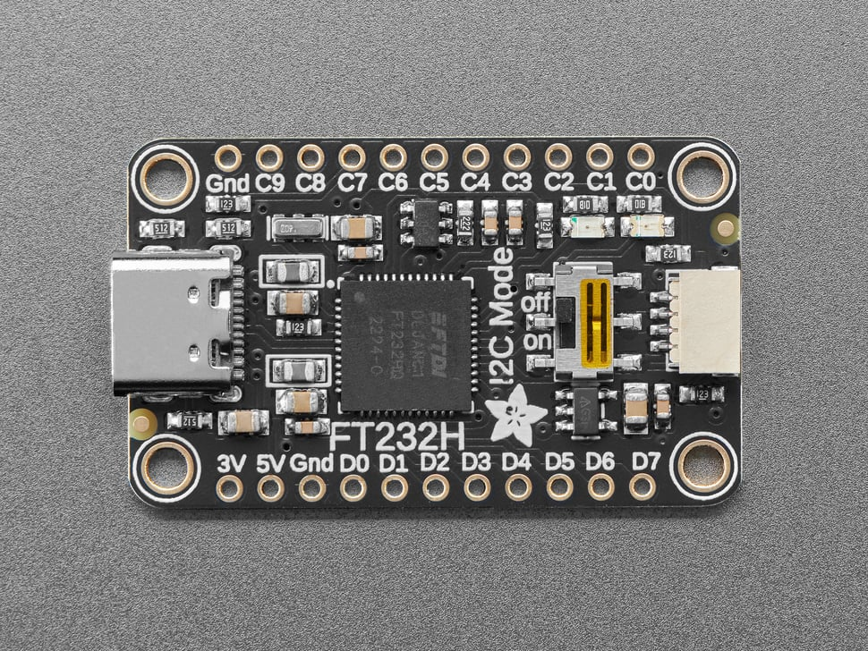

# FT232H USB GPIO Interface

[Adafruit page](https://www.adafruit.com/product/2264){ .md-button target=_blank rel=noopener }
[PCB files](https://learn.adafruit.com/adafruit-ft232h-breakout/downloads){ .md-button target=_blank rel=noopener }

{ width="360" }


The FT232H breakout is used as a **GPIO output interface** when running the temperature control loop on a Windows workstation.

In this setup, temperature is measured using a **National Instruments NI-9211 thermocouple module**, which requires the control software to run on Windows with NI drivers.

Since Windows machines do not provide native GPIO, a USB-GPIO bridge is required to drive the heater control hardware.

For this purpose the system uses an **Adafruit FT232H breakout**.


## Role in the control loop

The FT232H is used to generate the **heater control signal**.

Typical signal chain:

```mermaid
flowchart TD

subgraph Measurement
    TC["Thermocouple"]
    NI["NI-9211"]
end

subgraph Software
    WIN["Windows"]
    PY["TemperatureControl (Python)"]
end

subgraph Actuation
    FT["FT232H GPIO"]
    SSR["SSR"]
    H["Heater"]
end

TC --> NI
NI --> WIN
WIN --> PY
PY --> FT
FT --> SSR
SSR --> H

classDef sensor fill:#243322,stroke:#6ce3a1
classDef software fill:#1e2a3a,stroke:#6cb3ff
classDef actuator fill:#3a2a1e,stroke:#ffb86c

class TC,NI sensor
class WIN,PY software
class FT,SSR,H actuator
```



## Related software modules


[TemperatureControl](https://github.com/queezz/TemperatureControl){ .md-button target=_blank rel=noopener }
[NI9211.py](https://github.com/queezz/TemperatureControl/blob/main/src/temperature_control/sensors/ni9211.py){ .md-button target=_blank rel=noopener }
[ft232h.py](https://github.com/queezz/TemperatureControl/blob/main/src/temperature_control/sensors/ft232h.py){ .md-button target=_blank rel=noopener }


## Notes

The FT232H is mainly used as a **simple GPIO bridge** for heater control.

While this architecture introduces several layers:

```
NI → USB → Windows → Python → FT232H → SSR → heater
```

it provides reliable thermocouple measurements using the **NI-9211 isolated input hardware**.

Future work may include building a dedicated **isolated thermocouple acquisition board** to remove the NI dependency.