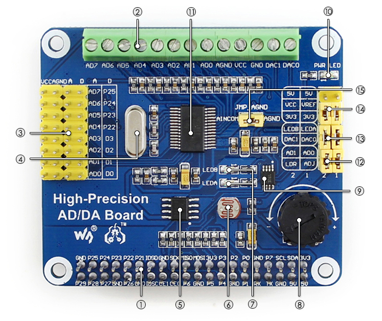
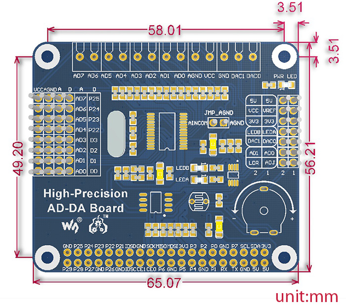

# High Precision AD/DA module

## About
[Dev Wiki](https://www.waveshare.com/wiki/High-Precision_AD/DA_Board){ .md-button target=_blank rel=noopener }
[Switch Science Shop](https://www.switch-science.com/products/7539?srsltid=AfmBOoov_O4_5KQ-dzdoikI8PUBTkQR9psVJ4mIv1gOg4gdYmNRye9Ep){  .md-button target=_blank rel=noopener }
[Waveshare Shop](https://www.waveshare.com/high-precision-ad-da-board.htm){  .md-button target=_blank rel=noopener }

Raspberry Pi High-Precision AD/DA Expansion Board

## What's on the board

{ width="500" }

1. Raspberry Pi GPIO interface : for connecting with the Pi
2. AD/DA input/output : screw terminals
3. AD input : pinheaders, the pinout is compatible with Waveshare sensor interface standard, easy to connect various analog sensor modules
4. 7.68M crystal
5. LM285-2.5 : provides reference voltage for the ADC chip
6. Photo resistor
7. LED output indicator
8. 10K potentiometer
9. DAC8552 : 16bit high-precision DAC, 2ch
10. Power indicator
11. ADS1256 : 24bit high-precision ADC, 8ch (4ch differential input)
12. ADC testing jumper
13. DAC testing jumper
14. Power selection jumper
15. ADC reference ground configuration : when AD single inputted, the AINCOM is reference terminal, can be connected to GND or external reference voltage

## Pins
| PIN                                           | SYMBOL | DESCRIPTION                              |
|-----------------------------------------------|--------|------------------------------------------|
| 1, 17                                         | 3.3V   | Power supply (3.3V)                       |
| 2, 4                                          | 5V     | Power supply (5V)                         |
| 3, 5, 7, 8, 10, 18, 22, 24, 26, 27, 28, 29, 32, 36, 38, 40 | NC     | NC                                       |
| 6, 9, 14, 20, 25, 30, 34, 39                  | GND    | Ground                                   |
| 11                                            | DRDY   | ADS1256 data ready output, low active    |
| 12                                            | RESET  | ADS1256 reset input                      |
| 13                                            | PDWN   | ADS1256 sync/power off input, low active |
| 15                                            | CS0    | ADS1256 chip select, low active          |
| 16                                            | CS1    | DAC8552 chip select, low active          |
| 19                                            | DIN    | SPI data input                           |
| 21                                            | DOUT   | SPI data output                          |
| 23                                            | SCK    | SPI clock                                |
| 31, 33, 35, 37                                | GPIO   | Extend to sensor interface               |

## Dimensions
{ width="360" }
