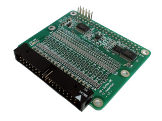

# AIO-32/0RA-IRC – I²C Analog Input Board
## About

[Board Home](https://www.y2c.co.jp/i2c-r/aio-32-0ra-irc/){ .md-button target=_blank rel=noopener }
[Python Dev](https://www.y2c.co.jp/i2c-r/aio-32-0ra-irc/raspberrypi-python/){ .md-button target=_blank rel=noopener }
[Schematics](../../assets/y-corp-adc-schematic.pdf){ .md-button target=_blank rel=noopener }

I2C アナログ入力ボード AIO-32/0RA-IRC by Y-Corporation

An I²C-connected analog input board with **32 channels** (16-bit resolution).  
Designed for use with **Raspberry Pi** and **Jetson Nano** as an expansion board.

{ width="360" }
---

## Features

### Input range
>    - *Single-ended:* **0–10 V** (only positive voltages accepted)  
>    - *Differential:* **±10 V** (AIN+ and AIN– must still be ≥0 V)

### Gain settings
  - selectable full-scale ranges  
  - ±10 V, ±5 V, ±2.5 V, ±1.25 V
### Channel modes
  - 32 single-ended inputs  
  - 16 differential inputs
### Misc
- **Stackable**, works with Raspberry Pi 5/4/3/2/Zero, Jetson Nano, and Y2 I²C boards  
- **I²C bus voltage:** 3.3 V  
- **Power:** 5 V DC, <10 mA  
- **Operating conditions:** 0–50 °C, 10–90% RH (non-condensing)  
- **Compliance:** RoHS2 (10 substances)

---

## Included Accessories

- 4× spacers (M2.6, 12 mm, male–female, metal)  
- 4× screws  
- 4× nuts  
- 1× connector pin protective cover (for J1)

---

## Internal Components

- **ADS1115** – 16-bit A/D converter  
- **CD74HC4067** – multiplexer  
- **PCA9554C** – I/O expander  
- **XG4C-3434 / J1** – connectors

[ADS1113 – TI](https://www.ti.com/lit/ds/symlink/ads1113.pdf){ .md-button target=_blank rel=noopener }   [ADS1115 – TI](https://www.ti.com/jp/lit/ds/symlink/ads1115.pdf){ .md-button target=_blank rel=noopener } [CD74HC4067 – TI](https://www.ti.com/lit/ds/symlink/cd74hc4067.pdf){ .md-button target=_blank rel=noopener }  

[PCA9554B / PCA9554C – NXP](https://www.nxp.com/docs/en/data-sheet/PCA9554B_PCA9554C.pdf){ .md-button target=_blank rel=noopener }  [XG4 Connector – Omron](https://omronfs.omron.com/en_US/ecb/products/pdf/en-fcc.pdf){ .md-button target=_blank rel=noopener }

