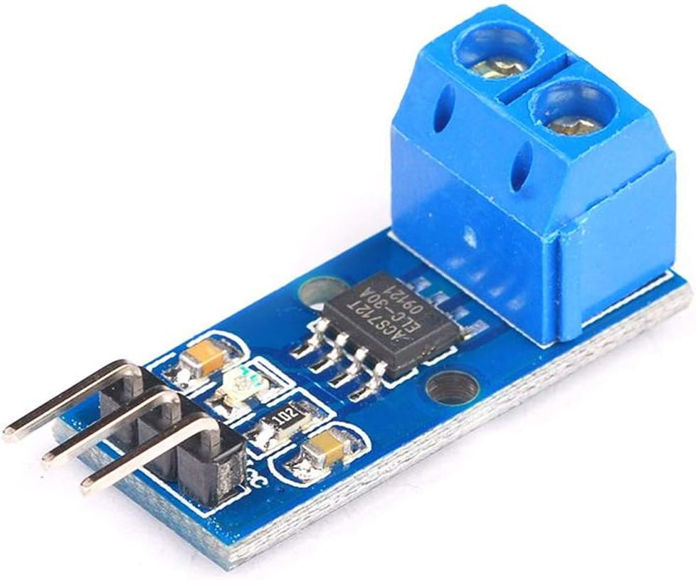

# ACS712 Hall Sensor

[Amazon Module](https://www.amazon.co.jp/-/en/dp/B00JQ1XU6A?ref_=ppx_hzsearch_conn_dt_b_fed_asin_title_2){ .md-button target=_blank rel=noopener }
[Datasheet](./acs712-datasheet.pdf){ .md-button target=_blank rel=noopener }
[In Control Unit](https://github.com/queezz/ControlUnit/blob/master/controlunit/devices/conversions.py#L60){ .md-button target=_blank rel=noopener }

{ width="300" }

## About

The device consists of a precise, low-offset, linear Hall circuit with a copper conduction path located near the surface of the die.  
Applied current flowing through this copper conduction path generates a magnetic field which the Hall IC converts into a proportional voltage.  

Device accuracy is optimized through the close proximity of the magnetic signal to the Hall transducer.  
A precise, proportional voltage is provided by the low-offset, chopper-stabilized BiCMOS Hall IC, which is programmed for accuracy after packaging.

## Sensitivity

| Model | Range | Sensitivity |
|-------|-------|-------------|
| ACS712-05B | ±5 A  | 185 mV/A |
| ACS712-20B | ±20 A | 100 mV/A |
| ACS712-30B | ±30 A | 66 mV/A  |
