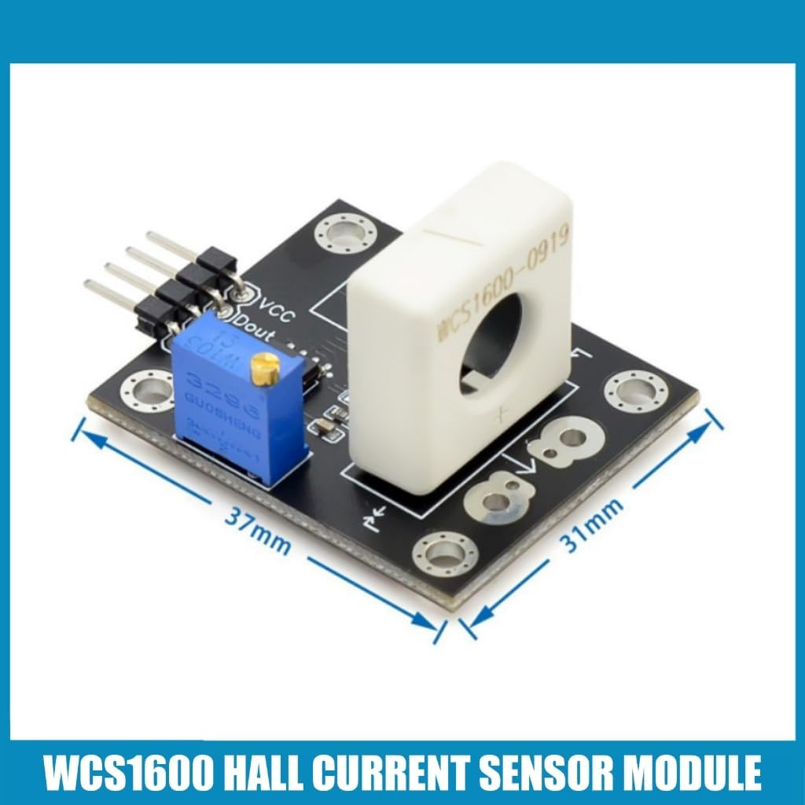
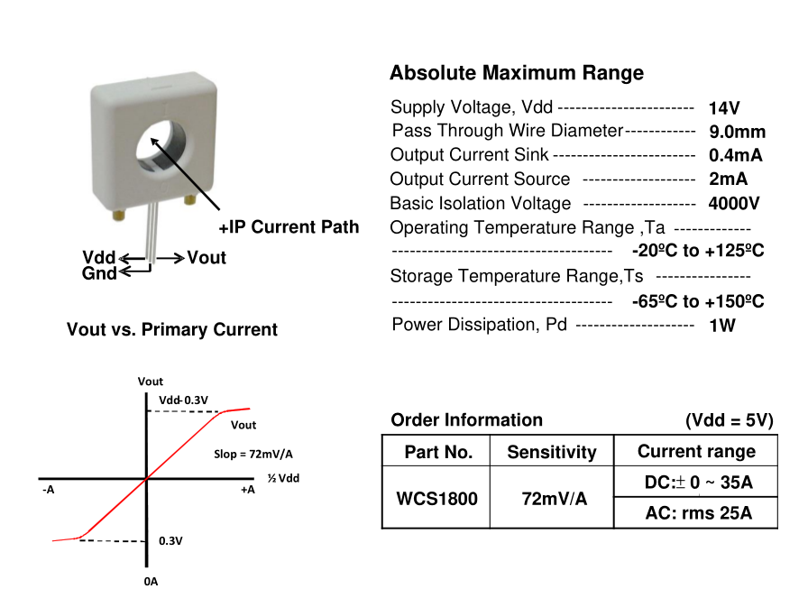

# WSC1800 Hall Sensor

[Amazon Module](https://www.amazon.co.jp/-/en/dp/B0F9DTB95Y/ref=sr_1_6?dib=eyJ2IjoiMSJ9.DfKgCSrzL1Rr9QvAiOVf5Ke5Y4bBzklcn_V6gwuVRCMO6Pk1yYaF552ARl64OHNST_39pgkQOMlBPOLEsD1jksy5-yUuN1vh4ZLg4VUyyaBvrWroIuvkfwGxgkmFTPxwAxVI3TGvRVa67frZcx1ONJb6Y_cJ1a7RAsxP2IZm8j5fRE99DCPa1cd0sL85dnhxyaHbtC8qsftaH5WIWb4sDzHHqUCvUfSozVDZQ1tZIejKT-8LqO14PXlO3R5EO6uFhZdXETjnWZiicF2Pz983Nf5wKwM8fD9PWC6XCIoogNo.xSLlVbnao8HFf4uXNs6z5rdY68PFQdsdlLgKwdIxdhI&dib_tag=se&keywords=WCS1800&qid=1758270157&sr=8-6&ufe=app_do%3Aamzn1.fos.f851e75d-a860-4774-84a1-525c65264f29&th=1){ .md-button target=_blank rel=noopener }
[Docs](../../assets/WCS1800.pdf){ .md-button target=_blank rel=noopener }

{ style="height:300px;" }
{ style="height:300px;" }

## About

The **Winson WCS1800** is a linear Hall-effect current sensor with a 9 mm through-hole conductor path.  
It measures both **DC and AC currents** up to **±35 A**, while maintaining **4 kV electrical isolation** between the sensed conductor and the sensor electronics.

- **Output**: Ratiometric analog voltage, ~2.5 V at zero current, with sensitivity ≈ 72 mV/A  
- **Range**: 0 – 35 A (at 5 V supply)  
- **Features**:
    - High isolation design (no need to break existing circuit)  
    - Wide supply range: **3 – 12 V**  
    - Low operating current (~3 mA)  
    - 23 kHz bandwidth for AC current sensing  
- **Applications**: Motor control, load detection, over-current fault protection, intelligent power management

On breakout boards, the sensor is often combined with an **MCP602 op-amp/comparator** to provide:

- **AOUT** – analog output proportional to current (connect via ADC to Raspberry Pi or MCU)  
- **DOUT** – digital threshold output, set via onboard trimpot (logic signal)  

## Electrical Characteristics
T = +25 °C, Vdd = 5.0 V

| Characteristic            | Symbol   | Test Conditions        | Min   | Typ   | Max   | Units |
|---------------------------|----------|------------------------|-------|-------|-------|-------|
| Supply Voltage            | Vdd      | —                      | 3.0   | —     | 12    | V     |
| Supply Current            | Isupply  | IP = 0 A               | —     | 3.5   | 6.0   | mA    |
| Zero Current Vout         | V0G      | IP = 0 A (DC Mode)     | 2.35  | 2.5   | 2.65  | V     |
| Conductor Through Hole    | —        | —                      | —     | 9.0   | —     | mm²   |
| Sensitivity               | Sens     | IP = ±10 A             | 60    | 72    | 84    | mV/A  |
| Bandwidth                 | BW       | —                      | —     | 23    | —     | kHz   |
| Measurable Current Range  | MR       | Vdd = 5V (DC Mode)     | —     | ±35   | —     | A     |
|                           |          | Vdd = 5V (AC RMS)      | —     | 25    | —     | A     |
| Temperature Drift         | ΔVout    | IP = 0 A               | —     | ±1.0  | —     | mV/°C |
| Output Noise              | Vnp-p    | IP = 0 A               | —     | 15    | —     | mV    |
| Output Noise (filtered)   | Vnp-p    | IP = 0 A, C = 0.01 µF  | —     | 3     | —     | mV    |
