# Mitsubishi Turbo Pump Restoration

## Overview

Restoring an old Mitsubishi turbo pump and controller.

## Hardware

## Mechanical Work

TIG welding a flange to adapt the pump.

## Controller Diagnostics

## First Startup

## Pump-down Results

| Day        | Pressure   |
| ---------- | ---------- |
| Tuesday    | 5.8×10⁻⁵ Torr |
| Wednesday  | 5.6×10⁻⁷ Torr |
| Thursday   | 3.6×10⁻⁷ Torr |

Performance improved as capacitors warmed up over the first days of operation.

## Observations

## Image Gallery

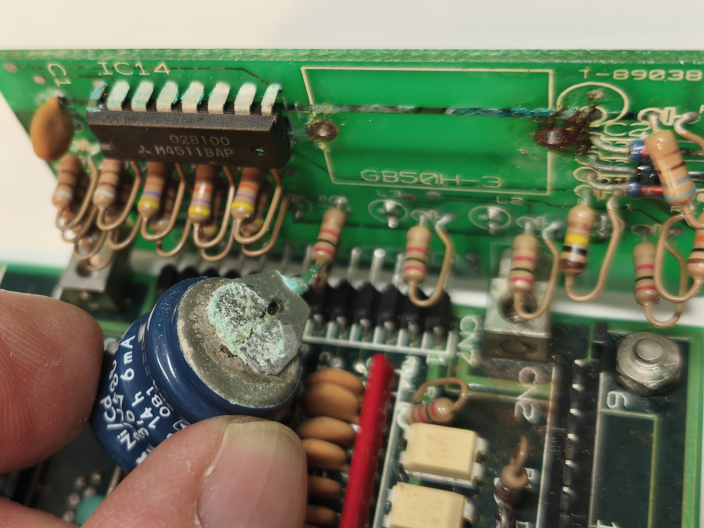
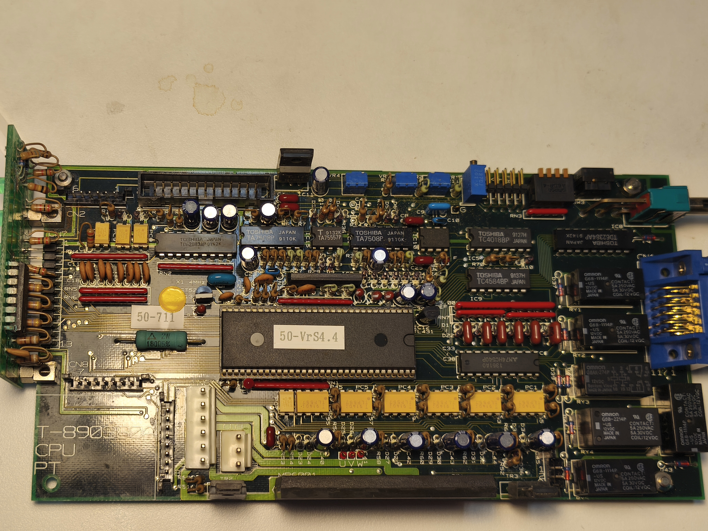
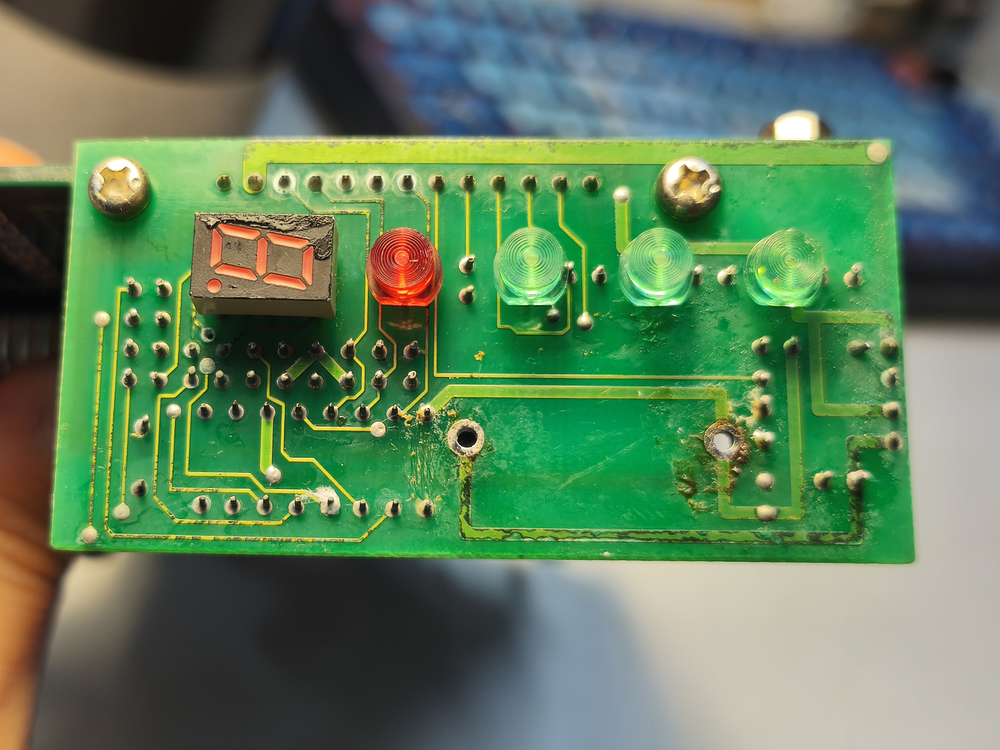
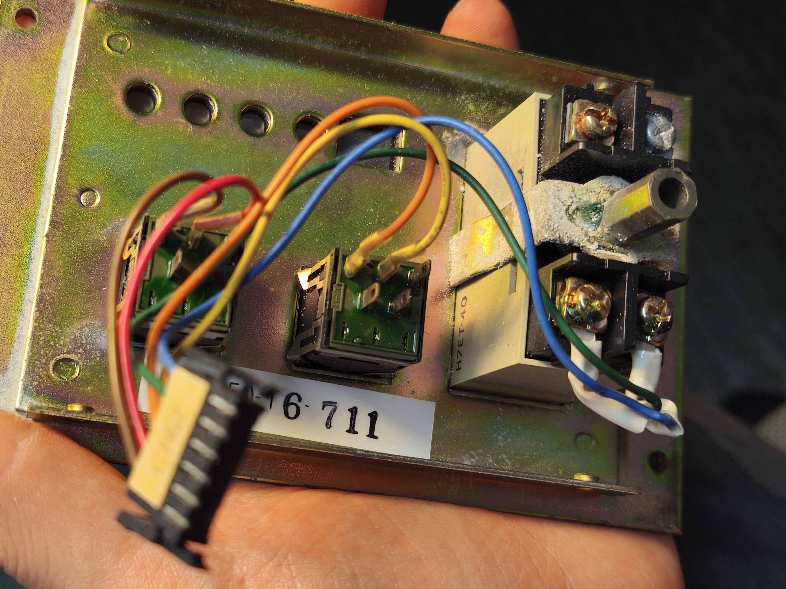
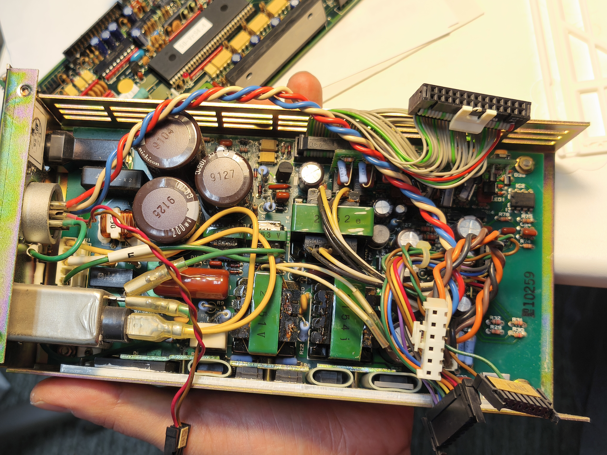
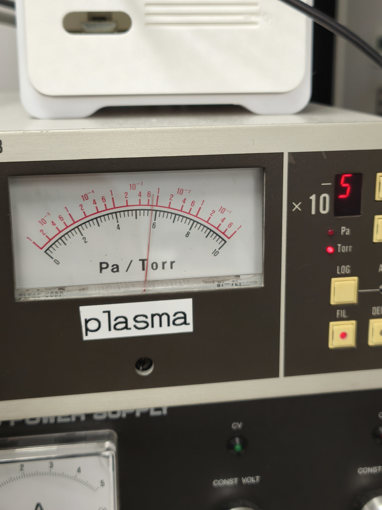
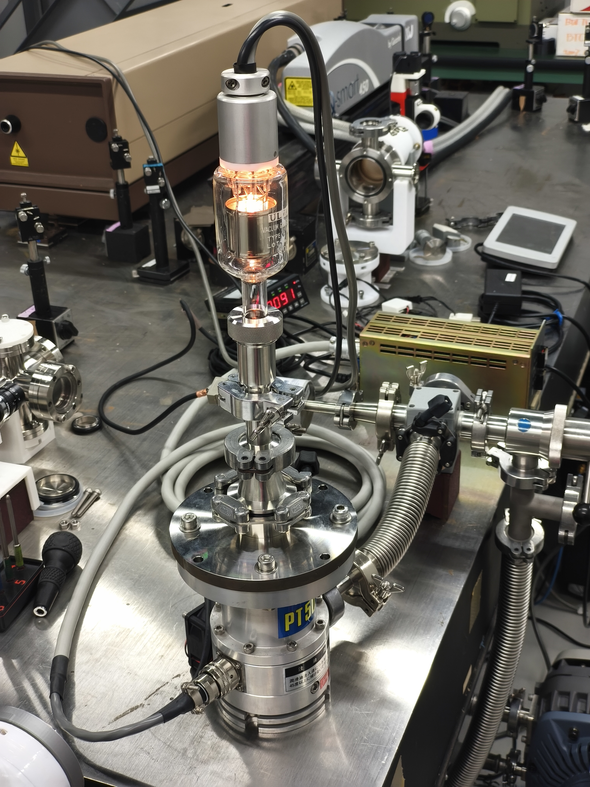
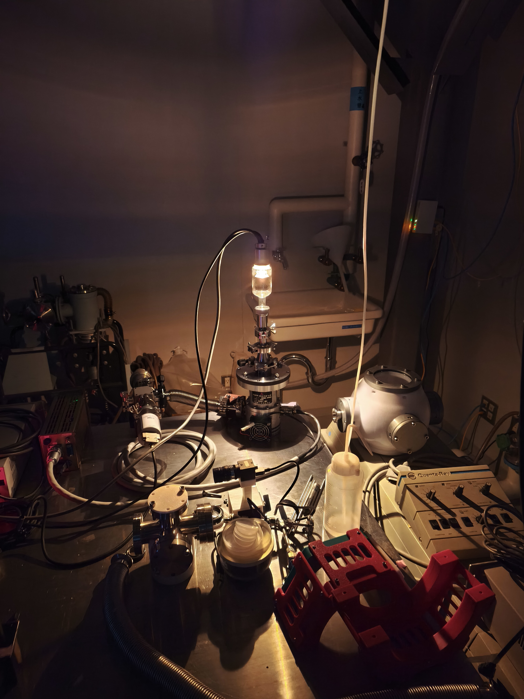
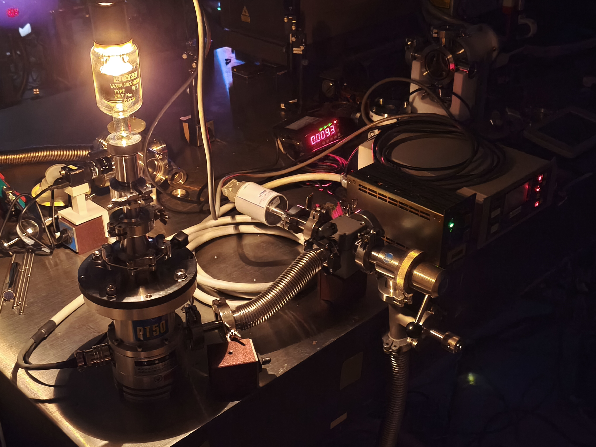
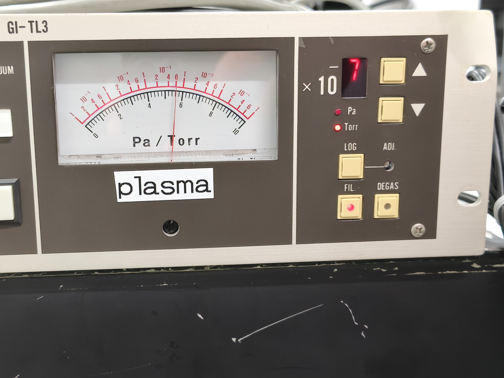
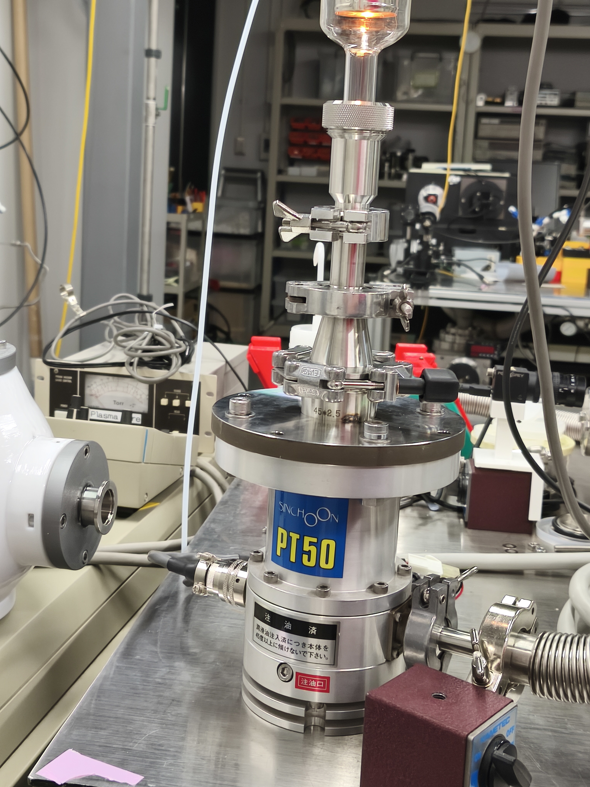
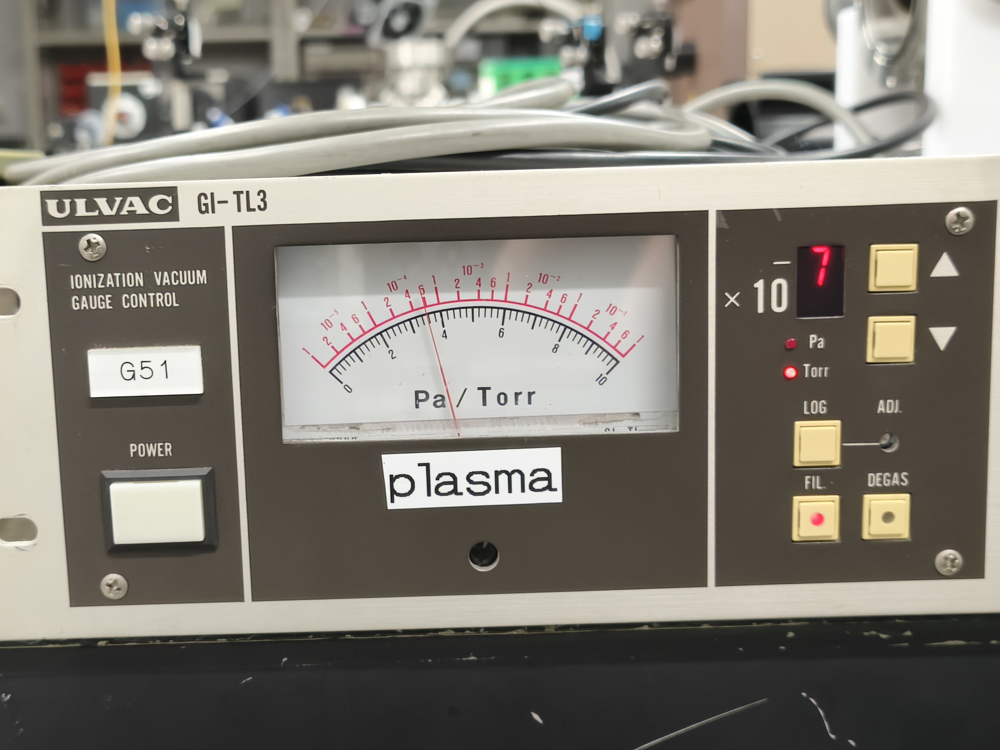
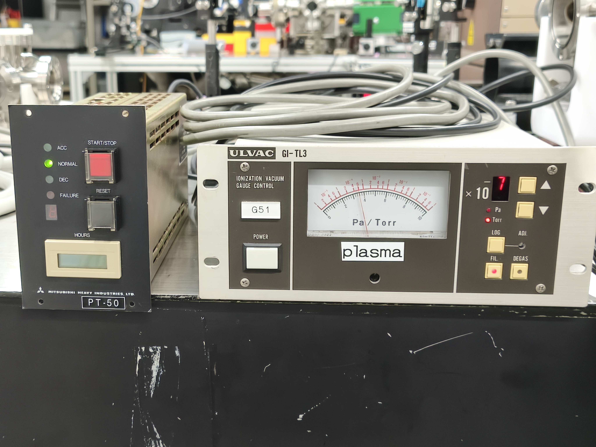

