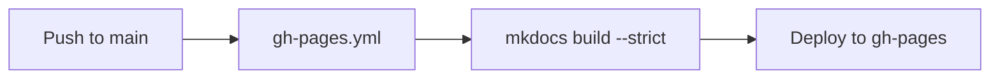

# AKLab MkDocs Standard

Documentation conventions and setup reference for AKLab repositories.
This page is the canonical description of the MkDocs configuration emitted by
[`scaffold.py`](scaffold.md) and used across all AKLab docs sites.

---

## Philosophy

Documentation in AKLab repos is:

- **Restrained** — no unnecessary sections, headings, or nesting
- **Technical** — written for practitioners, not general audiences
- **Persistent** — stable URLs, preserved history, no silent rewrites of existing pages
- **Figure-led** — diagrams and screenshots carry the argument; prose supports them

The README covers installation only.
The `docs/` tree covers everything else.

---

## Why Material for MkDocs

[Material for MkDocs](https://squidfunk.github.io/mkdocs-material/) is the standard theme because:

- Good defaults, well-documented customization
- Native dark/light mode with CSS variable overrides
- Tab-based navigation maps naturally to repo domains
- Built-in support for admonitions, code blocks, footnotes, and tables
- Mermaid diagrams with a one-line config
- MathJax integration without a separate plugin

---

## Visual Identity

All AKLab docs sites share a single color scheme: amber/gold brand on a dark GitHub-like
background. The scheme is named `bh-dark` and lives in `docs/styles/brand.css`.

Key CSS tokens:

| Token | Value | Purpose |
|---|---|---|
| `--md-primary-fg-color` | `#d98e04` | Header, tabs, links |
| `--md-accent-fg-color` | `#66ffa8` | Hover / focus accents |
| `--md-default-bg-color` | `#0d1117` | Page background |
| `--md-code-bg-color` | `#1e2228` | Code block background |

The light mode palette uses Material's built-in `amber` primary.

Both palettes are declared in `mkdocs.yml` under `theme.palette` so the
toggle button appears automatically.

---

## GitHub Pages Deployment

Pages are published via
[peaceiris/actions-gh-pages](https://github.com/peaceiris/actions-gh-pages)
to the `gh-pages` branch. The workflow lives at `.github/workflows/gh-pages.yml`.

Key constraints:

- Triggered on push to `main` or `master`
- Runs `mkdocs build --strict` — broken links or missing references fail the build
- Requires only `contents: write` permission; no extra secrets beyond `GITHUB_TOKEN`
- Published directory is `./site`; the `site/` directory is gitignored

The strict build ensures the deployed site is always internally consistent.

---

## Navigation Philosophy

Keep navigation shallow:

- Prefer flat lists over deep nesting
- One level of subsections is acceptable; two is unusual
- Top-level nav tabs correspond to major domains: Hardware, Software, Lab, Seminar
- Do not create a subsection for a single page
- Emoji prefixes are used sparingly for visual scanning; keep them consistent

---

## README vs Docs Separation

| Location | Content |
|---|---|
| `README.md` | Setup, venv, install — things needed before the site is reachable |
| `docs/index.md` | Entry point, highlights, links to key sections |
| `docs/**/*.md` | All substantive documentation |

The README is not mirrored into `docs/`. Keep them separate and the README short.

---

## Extensions

The canonical extension set:

| Feature | Extension / Plugin |
|---|---|
| Diagrams | `pymdownx.superfences` + Mermaid CDN |
| Math | `pymdownx.arithmatex` + MathJax CDN |
| Image lightbox | `mkdocs-glightbox` |
| Code copy button | `content.code.copy` (theme feature) |
| Tabbed content | `pymdownx.tabbed` |
| Collapsible notes | `admonition` + `pymdownx.details` |
| Nested lists | `mdx_truly_sane_lists` (nested_indent: 4) |
| Permalinks | `toc` with `permalink: true` |

Mermaid example:



---

## Contributor Continuity

- **Do not rename pages silently.** Old URLs break bookmarks, issues, and search results.
- **When a page must move**, leave a redirect or a short note pointing to the new location.
- **Keep commit history intact.** Do not squash historical context.
- **Add new content as new pages or sections**, not as rewrites of existing ones.
- **Never commit the `site/` directory.** It is a build artifact.

These constraints exist because repos outlive their original contributors.
A new team member reading the git log three years later needs to understand
what changed and why.

---

## Emitting This Setup with scaffold.py

Pass `--aklab` when scaffolding a new docs repository:

```bash
python scaffold.py myrepo \
  --author "Your Name" \
  --email "you@example.com" \
  --desc "Short description" \
  --repo-url "https://github.com/org/myrepo" \
  --aklab
```

This emits:

- `mkdocs.yml` with the `bh-dark` palette
- `docs/styles/brand.css` with the full AKLab color scheme
- `.github/workflows/gh-pages.yml`
- `docs/software/` with placeholder pages
- `CONTRIBUTING.md`

See [scaffold.py usage](scaffold.md) for full options.
